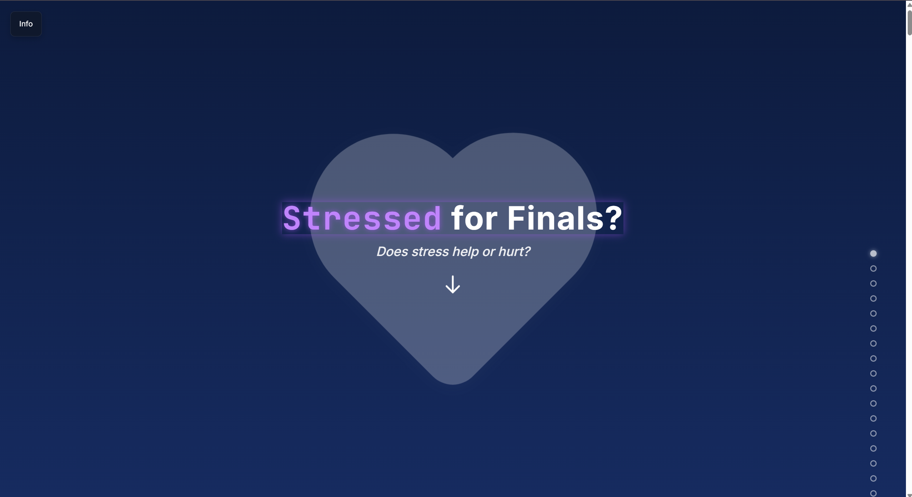

# Under Pressure: What Exam Stress Really Looks Like

An interactive data storytelling project that visualizes real-time physiological stress responses of students during exams. Built with **D3.js** and multi-sensor data, this dashboard explores how stress manifests through signals like electrodermal activity (EDA), heart rate (HR), blood volume pulse (BVP), and skin temperature (TEMP).  

 <!-- replace with actual path if you want to show a screenshot -->

## 📖 Project Overview
Exams are stressful — but what does stress actually look like inside the body?  

This project uses **Empatica E4 wristband data** collected from **10 students** across three major exams (Midterm 1, Midterm 2, and the Final) to decode how stress evolves before, during, and after exams.  

Key features include:
- **Student Profiles**: Individual EDA and HR curves visualized over exam timelines.  
- **Comparative Stress Explorer**: Compare multiple students’ physiological responses side by side.  
- **Routine Simulator**: Create your own pre-exam routine (sleep, food, exercise, etc.) and match with a real student’s stress profile.  
- **Stress Doppelgänger**: Track your matched student’s performance against others.  
- **Health vs. Score**: Scatterplots connecting stress signals to exam scores.  

---

## 🧠 Data & Metrics
We tracked four core physiological signals using Empatica E4 wearables:  

- **Electrodermal Activity (EDA):** Changes in skin conductivity caused by sweat gland activity.  
- **Heart Rate (HR):** Beats per minute, often spiking under stress.  
- **Blood Volume Pulse (BVP):** Captures cardiovascular changes during mental effort.  
- **Skin Temperature (TEMP):** Drops in peripheral temperature reflect stress responses.  

---

## 🛠️ Tech Stack
- **Frontend**: D3.js, HTML, CSS, JavaScript  
- **Visualization**: Interactive dashboards, line plots, scatterplots, bar charts  
- **Data Processing**: Python (NumPy, Pandas) for preprocessing E4 sensor data  
- **Deployment**: GitHub Pages / local browser  

---

## 🚀 Features in Action
- Click on desks to view a student’s **EDA stress curve** during an exam.  
- Compare stress responses between multiple students with a **multi-line profile view**.  
- Explore **minute-by-minute heart rate** synced with a heartbeat sound.  
- Build your own **morning routine** to see how your pre-exam choices (e.g., skipping breakfast, exercising) align with stress data.  
- Track your **stress doppelgänger** and visualize stress-performance relationships.  

---

## 📊 Visual Highlights
- **Student Desks Dashboard** – A classroom view of real-time stress profiles.  
- **Stress Doppelgänger Race** – See how matched students stack against peers.  
- **Health Metrics vs. Score** – Discover correlations between physiological stress and exam performance.  

---

## 📌 How to Run
1. Clone the repository:
   ```bash
   git clone https://github.com/your-username/stress-decoded.git
   cd stress-decoded
